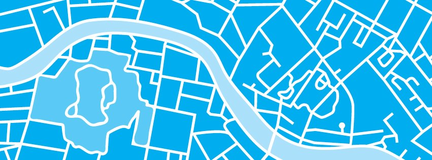

# Forecasting a Carbon Zero City 

## Data

I sourced electrical consumption data through the City of Gainesville website. The data contains over 9 million records dating from 2012 to September 2020. Covering these 8 years, the dataset includes montly electriity use at all addresses in Gainesville. The data also contains latitutde and longitude for each address.

## Premise 

* Local climate action is more obtainable than national change
* hundreds of cities globally have committed to Carbon Neutrality by 2035 -- including New York and Seattle. 
* I was curious how a typical, smaller city might be doing towards a path to Carbon Neutrality. 
* I chose Gainesville, FL due to it's easily available electrical consumption data 
* This project aims to use machine learning to accuracy predict the future montly electrical consumption reduction at a residence or business in Gainesville. 
* Predicting future outcomes will allow us to predict unrealized investment opportunities in energy efficiency improvements.
* Investors could use this to identify the scale of investment opportunities based on how far off businesses and residents are from possible efficiency. 

## Data

### Data Manipulation 

* Sourced data from the U.S. Census Bureau on population for the City of Gainesville
* Sourced monthyl electrical consumption data from the City of Gainesville's website
* Merged data for the population of Gainesville with electrical consumption data to analyze and visualize.

### Variable Creation
* Once I had the data I needed as a single dataframe, my first goal was to aggregate electrical consumption to find the average electrical consumption for each month for the city since the data collection started in 2012. Using Pandas groupby() and .mean(), I found 106 monthly values. 
* Average monthly electrical consumption per capita 
* cost per unit reduction 

## Judgemental Forecasting

Judgmental forecasts are generated to estimate the impact of a greater energy efficiency improvement rate. These are shown by the green items. The pink items indicate electrical data used obtained from the City of Gainesville. The blue items show things that are calculated from the data provided.

### Summary of Forecast Process

### Assumptions

## Models

### ARIMA

## Performance based on changes in efficiency 

| Model | no consumption | 0.005 | 0.010 | 0.015 | 0.020| 0.025 |
|-----:|:-----:|:-----:|:-----:|:-----:|:-----:|:-----:|
|| ||MSE      | |    | |
| Random Forest | |  |  |  |  | |
| OLS Linear | |  |  |  |  | |
| OLS SMF    | |  |  |  |  | |

## Evaluation

## Insights

## Next Steps

## Sources
* U.S. Census Bureau (population data)
https://data.census.gov/cedsci/profile?g=1600000US1225175
* Carbon Zero: Imagining Cities That Can Save the Planet (images) https://www.amazon.com/Carbon-Zero-Imagining-Cities-Planet-ebook/dp/B00AEWHU8E