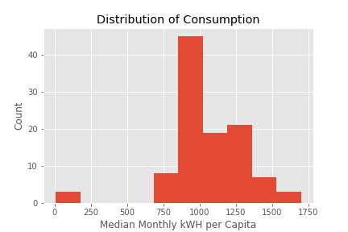
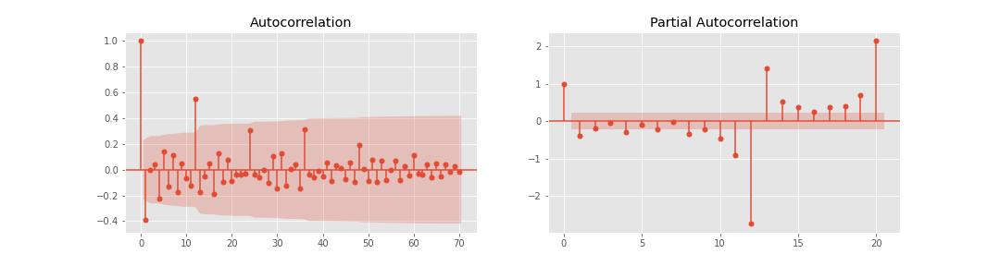
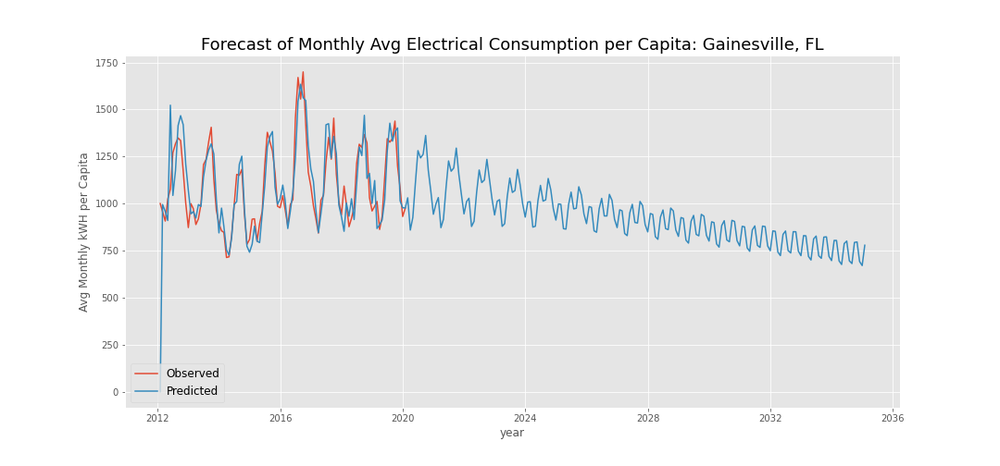
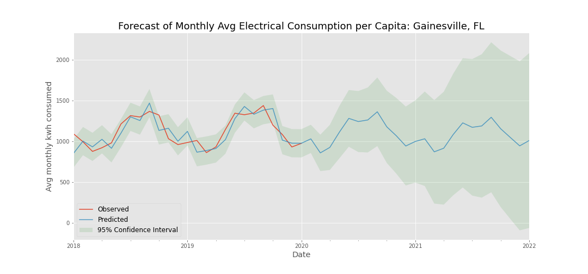
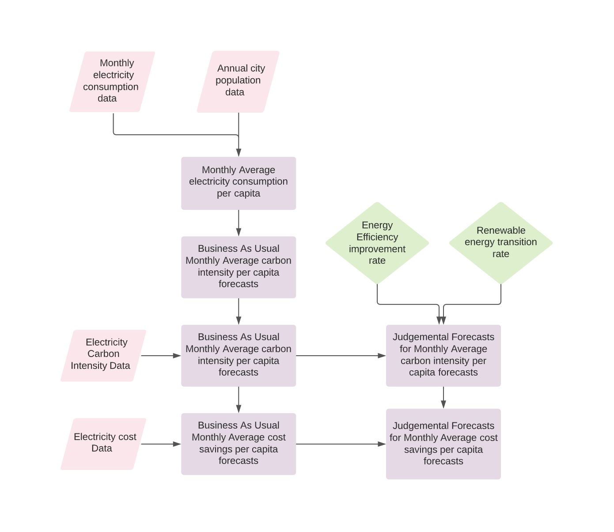

# Forecasting a Carbon Zero City
 

 
## Data
 
My focus was on electrical consumption data from the City of Gainesville website. The data contains over 9 million records dating from 2012 to September 2020. Covering these 8 years, the dataset includes monthly electricity use at all addresses in Gainesville. The data also contains latitude and longitude for each address.
<br>
 
## Premise
 
Hundreds of cities globally have committed to Carbon Neutrality by 2035 - including New York and Seattle. I was curious how a smaller city that hadn't (yet) made a commitment might be doing towards a path to carbon neutrality. I chose Gainesville, FL due to its size and easily available electrical consumption data.
 
This project aims to use machine learning to accurately predict the average future monthly electrical consumption reductions needed to achieve carbon neutrality by 2035 for each month along the way.
 
Predicting individual and aggregate reduction benchmarks could help expand investment and consumer cost savings opportunities in energy efficiency improvements.
<br>
 
## Overview of the Data
 
### Data Sources
 
* U.S. Census Bureau on population for the City of Gainesville
   * Gainesville_Population
* City of Gainesville's website
   * monthly_kwh_consumption by address
* EPA eGrid
   * Florida carbon intensity: 931.84 lb / MWh
<br>

## Variable Creation

Combining data into a single dataframe, I started by aggregating electrical consumption from individual addresses to find the average electrical consumption for each month for the city for each month since January 2012. Using Pandas groupby() and .sum(), I found 106 monthly values. I normalized the city's total consumption for each month by Gainesville's population each year to get my target variable, monthly average electrical consumption per capita. Below are the summary statistics and the plotted target values:

<br>

### Summary Statistics for target variable (monthly kwh / capita)
<br>

|       | avg_kwh_capita 
| :---        |    :----:  
| Count      | 106  
| Mean   | 1058.96 
| Std   | 270.92
| Min | 8.90     
| Max   | 1699.58  

<br>

### Plotted target values
 

 
Charting electrical consumption above shows a seasonal pattern and large drop at the start of the COVID pandemic. Both of these time index dependencies must be removed to create a set of stationary observations.
<br>

<br>
The COVID anomaly is also apparent by looking at this histogram showing counts for each electrical consumption value, which are in two distinct groups. The COVID values lie completely outside of the Gaussian distribution of the rest of the data.      
 
<br>
 
## Box-Jenkins Method Stationary Process
 
By removing the observations in the data that occured during the COVID pandemic, I can achieve better stationarity in my data. To validate this, I used the Augmented Dickey-Fuller (ADF) test to find p-values for my data before and after removing COVID dates.
 
 <br>

 ### ADF P-value with and without COVID observations

| with COVID | without COVID     |
| :---        |    :----:   |   
| 0.563      | 0.240  |

 <br>
 
While not within the 0.05 threshold yet for stationarity, removing observations during COVID significantly improved P-value.
 
I also checked how transforming my data using a log transform would impact my stationarity. It slightly increased my P-value from 0.240378 to 0.289347 so I did not use the log transform.

<br>
 Finally, I took the first and second difference of the data and ran an ADF test on each as well as for two regression orders. Here are the p-values for each:  
  <br>
  <br>

| Regression Order      | Diff 1 | Diff 2     |
| :---        |    :----:   |          ---: |
| c      | 0.180      | 2.552e-16  |
| ctt   | 0.620       | 1.113e-13e      |

 <br>

The data that was diffed twice is stationary with slightly better performance with a constant regression order.

 <br>

## Seasonal Decomposition
 
To get a clearer look at the data, I used seasonal_decompose() method. This generates four graphs: Observed, Trend, Seasonal, Residual. Looking at the graphs, the seasonal pattern is apparent. For the period parameter, I selected 12 because the sampling frequency is monthly (taken 12 times per year) over eight years. The residuals seem to be randomly distributed meaning that my data is stationary. 
 
<br>
 

 
## Assumptions
 
The EPA egrid sites Carbon intensity for all of Florida (including Gainesville) as:<br>
931.84 lb/MWh
 
Energy efficiency improvement and renewable energy transition rates will be constant between 2020 and 2035. This analogue judgemental adjustment is derived from projections in Bellingham's carbon policy.
 
## Model
 
### SARIMA
 
Since my data has a strong seasonal component, I used the Seasonal AutoRegressive Integrated Moving Average model, which includes a parameter for seasonal legnth. This allows the model to achieve better stationarity without further manual transformations. 
 
<br>
 


I found the autocorrelation and partial autocorrelation to get a rough sense for the complexity of my model for estimating a range of parameters for grid search. 
 
<br>
 
### Grid Search for Optimizing SARIMAX Parameters
I used GridSearch to iterate through possible values for the following SARIMA parameters both non-seasonal (lower case) and seasonal (uppercase):
* p, P (autoregressive terms)
* d, D (differencing needed to reach stationarity)
* q, Q (number of moving average terms - e.g. lags of the forecast errors)
* s (seasonal length in the data)
<br>
 
The GridSearch combination with the lowest AIC of -754.061 (indicating the strength of the model) was: 

| Parameter| Optimized value     |
| :---        |    :----:   |   
| autoregressive terms (p, P)      | 0, 2  |
| differencing needed to reach stationarity | 1, 1  |
| number of moving average terms     | 2, 1  |
| seasonal length in the data      | 4  |
<br>

Here's how it looks in code form 
```
 SARIMAX(0, 1, 2),(2, 1, 1, 4)) 
 ```
 
<br>
 
### Monthly Electricity Consumption Forecast to 2035 with SARIMAX
(does not reflect increases in population past 2020)

 <br>




### Monthly Electrical Consumption Forecast within the Nearer Term: More Reasonable

<br>


 
## Model Evaluation
 
### SARIMAX 
AIC: -754.061
* MSE - 0.0022
<br>

## Forecast of Business as Usual Carbon Emissions per Capita


## Forecast of Business as Usual Cost of Grid-electricity per Capita


 
## Next Steps
 
To project the impact of energy efficiency improvements and expanding renewable energy supply on electrical consumption, I will use Judgmental adjustments needed to reduce this emissions source to zero by the goal period.


### Summary of Forecast Process

 The scheme below shows how judgemental adjustments are used in the model: judgemental adjustments are shown by the green diamonds, pink squares indicate electrical data, and purple items show the elements calculated from the observed data.
 
 

 
Looking past electrical emissions reductions, incorporating emissions data from other emissions sources would help to complete the full carbon zero forecast. These emissions sources include transportation, agriculture, industry, waste stream and energy production.
 
 
## Sources
* U.S. Census Bureau (city population data)
https://data.census.gov/cedsci/profile?g=1600000US1225175
* Emissions reduction expert projections (https://carbonneutralbellingham.com/wp1/wp-content/uploads/2020/01/catf_2019_final_report.pdf)
* Electricity carbon intensity for Gainesville, FL (https://www.epa.gov/egrid/data-explorer)
* Banner image (Carbon Zero: Imagining Cities That Can Save the Planet  https://www.amazon.com/Carbon-Zero-Imagining-Cities-Planet-ebook/dp/B00AEWHU8E)
 
 
 
 
 
 

