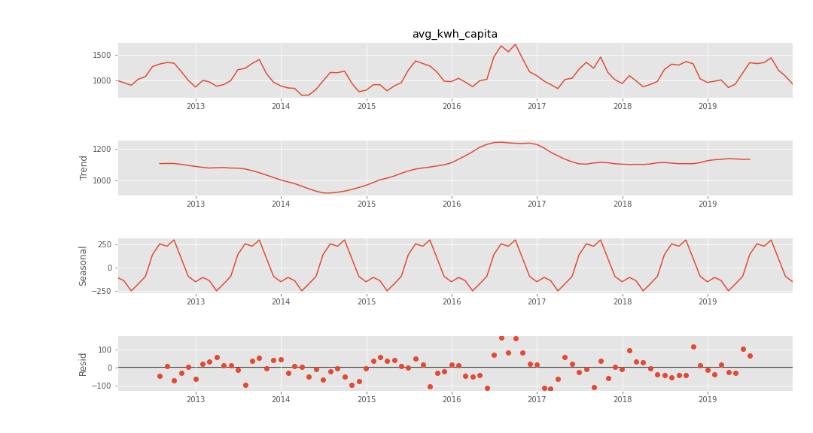
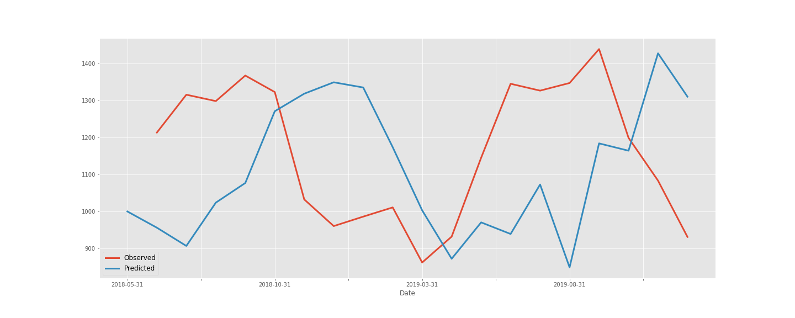

# Forecasting a Carbon Zero City 

## Data

My focus was on electrical consumption data from the City of Gainesville website. The data contains over 9 million records dating from 2012 to September 2020. Covering these 8 years, the dataset includes montly electriity use at all addresses in Gainesville. The data also contains latitutde and longitude for each address.
 

## Premise 

Hundreds of cities globally have committed to Carbon Neutrality by 2035 - including New York and Seattle. I was curious how a smaller city that hadn't (yet) made a commitment might be doing towards a path to carbon neutrality. I chose Gainesville, FL due to its size and easily available electrical consumption data. 

This project aims to use machine learning to accuracy predict the average future montly electrical consumption reductions needed for to achieve carbon neutrality by 2035 for each month along the way. 

Predicting individual and aggregate reduction benchmarks could help expand investment and consumer cost savings opportunities in energy efficiency improvements.
 

## Overview of the Data

### Data Sources 

* U.S. Census Bureau on population for the City of Gainesville 
    * Gainesville_Population
* City of Gainesville's website
    * monthly_kwh_consumption by address
* EPA eGrid 
    * Florida carbon intensity: 931.84 lb / MWh
 
## Variable Creation and Stationary Process Methods
Combining data into a single dataframe, I started by aggregating electrical consumption from individual addresses to find the average electrical consumption for each month for the city for each month since January 2012. Using Pandas groupby() and .mean(), I found 106 monthly values. I normalized the monthly average consumption by Gainesville's population each year to get my target variable, monthly average electrical consumption per capita. 

Charting electrical consumption above shows a seasonal pattern and large spike at the start of the COVID pandemic. Both of these time index dependencies must be removed to create a set of stationary observations so that summary statistics are consistent over time.
 

 
The COVID anomaly is also apparent by looking at this histogram showing counts for each electrical consumption value, which are in two distinct groups. The COVID values lie completely outside of the Gaussian distribution of the rest of the data. 

 

## Stationary Process

By removing the observation in the data during the COVID pandemic, I can achieve better stationarity in my data. To validate this, I used the Augmented Dickey-Fuller test to find p-values for my data before and after removing COVID dates: 

Before removing COVID data P-value: 0.562681

After removing COVID data P-value: 0.240378

While not within the 0.05 threshold yet for stationarity, removing observations during COVID significantly improved P-value.

I also checked how transforming my data using a log transform would impact my stationarity. It slightly increased my P-value from 0.240378 to 0.289347 so I did not use the log transform.
 

### Seasonal Decomposition 

 To get a clearer look at the data, I used seasonal_decompose() method. This generates four graphs: Observed, Trend, Seasonal, Residual. Looking at the graphs, the seasonal pattern is apparent. For the period parameter, I selected 12 because the samping frequency is monthly (taken 12 times per year) over eights years.

 

 

### Assumptions

The EPA egrid sites Carbon intensity for all of Florida (including Gainesville) as: 
931.84 lb/MWh

Energy effiency improvement and renewable energy transition rates will be constant bewteen 2020 and 2035. This analogue judgemental adjustment is derived from projections in Bellingham's carbon policy.

## Model

### SARIMAX

After splitting the data, used the Seasonal AutoRegressive Integrated Moving Average with eXogenous regressors model. I did not use eXogonous regressors so that parameter defaulted to None. I chose this model because it includes seasonal compontents for the order which takes into account the sesaonal length. This allows the model to achieve better stationarity without further manual transformations.

 

 

### Grid Search for Optimizing SARIMAX Parameters 
I used GridSearch to iterate through possible values for the following SARIMAX parameters both non-seasonal (lower case) and seasonal (uppercase): 
* p, P (autoregressive terms)
* d, D (differencing needed to reach stationarity)
* q, Q (number of moving average terms - e.g. lags of the forecast errors)
* s (seasonal length in the data)
 

The GridSearch combination with the lowest AIC (indicating the strength of the model) was SARIMAX(0, 1, 2),(2, 1, 1, 4) with an AIC of -756.33. 

 

 

### Monthly Electricity Consumption Forcast to 2035 with SARIMAX
*does not reflect increases in population past 2020

## Evaluation

SARIMAX MSE = 0.00223

 

## Next Steps

To project the impact of energy efficiency improvements and expanding renewable energy supply on electrical consumption, I used Judgmental adjustments from an analogue city where there has been more research with some data availble. These adjustments are based on expert projections for Bellingham, WA, which is approximately the same size as Gainesville. 

### Possible Limitations of Judgemental Adjustments 

Using judgemental adjustments about carbon reductions may not apply to Gainesville so a better analogue may yield better results. Additionally, Bellingham's projections may not be accurate making it a week signal for forcasting. Further information is needed to verify the accuracy of Bellingham's forecast - the data for which is not currently publicly available at the city level. 

The scheme below shows how judgemental adjustments are used in the model: judgemental adjustements are shown by the green diamonds, pink squares indicate electrical data, and purple items show the elements calculated from the observed data.

### Summary of Forecast Process

Looking past electrical emissions reductions, incorporating emissions data from other emissions sources would help to complete the full carbon zero forecast. These emissions sources include transportation, agriculture, industry, waste stream and energy production.

## Sources
* U.S. Census Bureau (city population data)
https://data.census.gov/cedsci/profile?g=1600000US1225175
* Emissions reduction expert projections (https://carbonneutralbellingham.com/wp1/wp-content/uploads/2020/01/catf_2019_final_report.pdf)
* Electricity carbon intensity for Gainesville, FL (https://www.epa.gov/egrid/data-explorer)
* Banner image (Carbon Zero: Imagining Cities That Can Save the Planet  https://www.amazon.com/Carbon-Zero-Imagining-Cities-Planet-ebook/dp/B00AEWHU8E)

